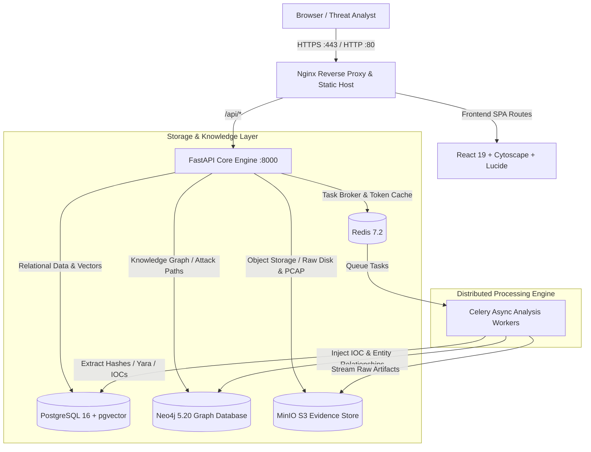

# NETRYX EVIDENCE 🛡️🔍

> **Enterprise Cloud-Native Digital Forensics, Incident Response & Threat Graph Investigation Platform**

[](https://github.com/yug1204/netryx-evidence/actions/workflows/deploy-pages.yml)
[](https://yug1204.github.io/netryx-evidence/)
[](https://fastapi.tiangolo.com)
[](https://react.dev)
[](https://neo4j.com)
[](https://github.com/pgvector/pgvector)
[](https://www.docker.com)

---

## 🌐 Live Access

- **Public Interactive App:** [https://yug1204.github.io/netryx-evidence/](https://yug1204.github.io/netryx-evidence/)
- **Repository:** [https://github.com/yug1204/netryx-evidence](https://github.com/yug1204/netryx-evidence)

---

## 🚀 One-Command Cloud VPS Deployment

Deploy the entire 8-container microservices platform to any Ubuntu/Debian Cloud VPS (AWS EC2, DigitalOcean, Hetzner, Linode) in 60 seconds:

```bash
curl -sSL https://raw.githubusercontent.com/yug1204/netryx-evidence/master/deploy.sh | sudo bash
```

The script automatically:
1. Installs Docker Engine and Docker Compose
2. Clones the repository to `/opt/netryx-evidence`
3. Generates cryptographically secure production keys for PostgreSQL, Neo4j, MinIO, and JWT
4. Builds and boots all 8 microservices via Docker Compose
5. Configures Nginx reverse proxy with routing and security headers
6. Verifies container health and prints your live server access points

---

## 🏗️ Architecture & Component Stack



---

## 🔑 Core Features

1. **Enterprise Case Management & Forensic Vault:**
   - Multi-tenant case tracking with full evidentiary chain of custody (NIST SP 800-86 compliant).
   - Immutable SHA-256 and MD5 cryptographic integrity verification on upload.
   - S3-compatible chunked upload handling disk images (E01/RAW), PCAPs, memory dumps, and logs.

2. **Interactive Graph Visualizer (Cytoscape.js):**
   - Real-time cyber threat graph mapping Threat Actors, Malware Families, C2 Infrastructure, Infected Hosts, and Lateral Movement.
   - Blast-radius discovery and Dijkstra shortest attack path routing.

3. **Autonomous Celery Worker Pipeline:**
   - Asynchronous parsing of PCAPs, PE/ELF binaries, Sysmon EVTX, and memory dumps.
   - YARA rule matching, high-entropy packed section detection, and IoC extraction.
   - Threat scoring algorithm (0-100) factoring CVSS, reputation feeds, and graph centrality.

4. **AI-Powered Forensic Assistant:**
   - Autonomous query engine for investigating IoCs, generating timeline summaries, and drafting incident triage reports.
   - Multi-turn investigation dialog with simulated evidence correlation.

5. **Production Dockerized Infrastructure:**
   - Multi-stage Docker builds for minimal attack surface.
   - Healthcheck orchestration across PostgreSQL, Neo4j, Redis, MinIO, and Celery.
   - Nginx reverse proxy with gzip compression and strict security headers.

---

## 💻 Local Development Setup

### Prerequisites
- Node.js 20+
- Python 3.11+
- Docker & Docker Compose (optional for containerized mode)

### 1. Run Frontend
```bash
cd frontend
npm install
npm run dev
```
Access the dev server at `http://localhost:5173`.

### 2. Run Backend with Docker
```bash
cp .env.example .env
docker compose up --build
```
Access:
- Frontend: `http://localhost`
- API Docs: `http://localhost:8000/api/docs`
- Neo4j Browser: `http://localhost:7474`
- MinIO Console: `http://localhost:9001`

---

## 🛡️ License

MIT License. Designed and engineered for high-consequence incident response teams and cyber forensic investigations.
